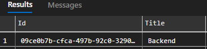
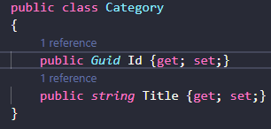

# DataAccess [ Acesso a dados com .NET ]

## Acesso puro ao banco de dados: 
https://docs.microsoft.com/pt-br/sql/connect/ado-net/overview-sqlclient-driver?view=sql-server-ver15  

ADO (através do SqlClient) - é a base de acesso a dados. Dapper, Entity e outras bibliotecas de acesso a dados fazem uso do ADO.

1. opção 1:  
  var connection = new SqlConnection(); 
            connection.Open(); 
                `//acesso ao banco de dados` 
            connection.Close(); 
2. opção 2:  
            using (var connection = new SqlConnection()) 
            { 
                `//acesso ao banco de dados` 
            } 

## Dapper: 
 https://docs.microsoft.com/pt-br/dotnet/standard/data/sqlite/dapper-limitations 
           
 Utilização de classes [com propriedades] para tipagem e rastreamento pelo dapper. 
 Importante: tipo e nome da propriedade deve ser o mesmo tipo e nome na tabela. Exceção: utilização de alias.

 Segue comparação:   

 >  OBS: ataque sqlinjection  
  
  -  ERRADO ->  `var insertSql = $@"insert into Category values 
                ({category.Id}, {category.Title} , ... )";` [não se pode concatenar, risco ataque]  

  -  CORRETO -> `var insertSql = $@"insert into Category values 
                ( @paramId, @paramTitle , @paramUrl, @paramSummary, @paramOrder, @paramDescription, @paramFeatured )";`
      
## 
 > ## Bibliotecas necessárias

| Tipo| adicionando  | removendo                                             |
|---  | --- | ----------------------------------------------------- |
| ADO | dotnet add package microsoft.Data.SqlClient --version x.x.x  | dotnet remove package microsoft.Data.SqlClient |
|  |  |        |
| DAPPER | dotnet add package dapper --version 2.0.90  | dotnet remove package dapper |
| |  | |

OBS: dotnet new console 
